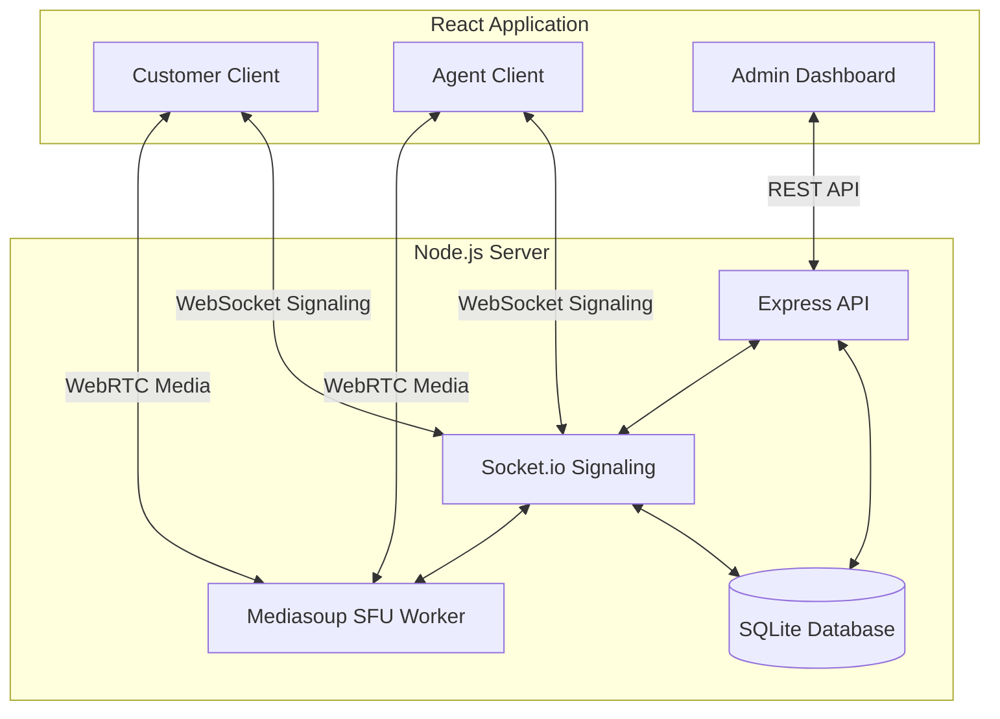

# Login Credentials & Architectural Diagram

## Login Credentials
This platform relies on a secure, token-based shareable link system rather than traditional usernames and passwords. This reduces friction for customers joining support calls. 

**To access the Admin Dashboard (Agent):**
- No login required for this demo. 
- Open the application at: `http://localhost:5173/dashboard`
- From here, the Agent can create a "New Support Session" which generates a unique, secure Room ID.

**To access the Call Room (Customer):**
- The Customer does not need an account. 
- They must use the exact secure URL generated by the Agent (e.g., `http://localhost:5173/room/<ROOM_ID>?role=customer`). 
- They will be prompted to enter a Display Name before joining the session. 

---

## Architectural Diagram

The platform uses a custom Mediasoup Selective Forwarding Unit (SFU) running on a Node.js backend. This allows all video traffic to be routed through our server instead of relying on P2P or third-party APIs.

