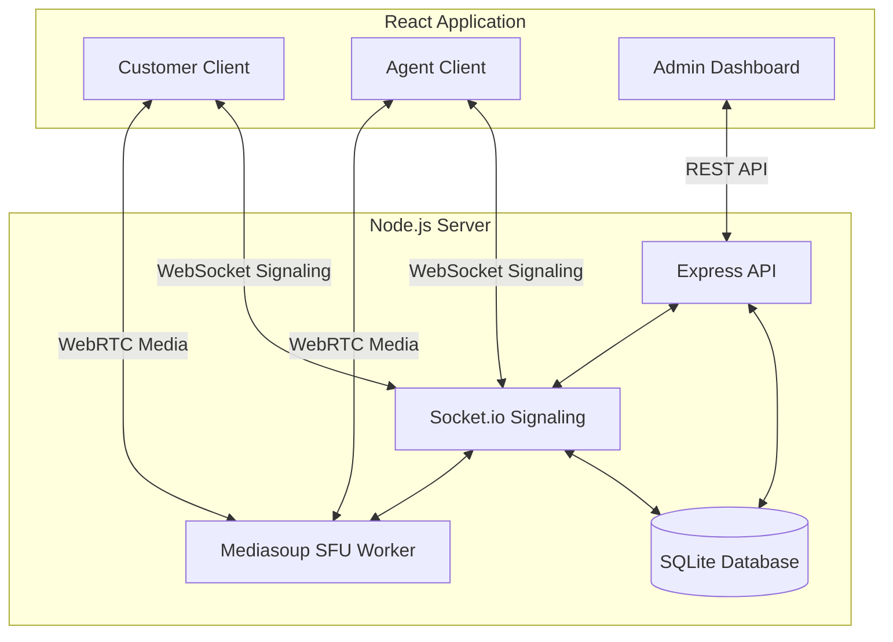

# Atomquest Hackathon 1.0: Real-Time Video Support Platform

**Built by:** Anusha Anchalia

This project is a fully functional, real-time video support platform designed specifically for customer support teams. Instead of relying on third-party video SDKs like Twilio or Agora, this platform implements a custom **Selective Forwarding Unit (SFU)** using Mediasoup to route media entirely on self-owned infrastructure, ensuring maximum privacy, control, and zero vendor lock-in.

---

## 🌟 Key Features

### Core Requirements
- **Browser-Native:** Both agents and customers join directly via the web browser—no app installation required.
- **Custom Video Infrastructure:** Powered by a Node.js/Mediasoup backend that handles highly efficient WebRTC routing.
- **Role-Based Access:** Agents have full administrative control (start/end sessions globally), while customers can securely join via one-time tokens.
- **Session History:** SQLite-backed persistence tracks exactly who joined, when, and for how long.
- **Real-Time Text Chat:** Synchronized in-call text chat persisted to the session record.

### 🚀 Bonus Features Successfully Implemented
- **Admin Operations Dashboard:** A centralized control panel to monitor active sessions, view participant durations, download recordings, and forcibly terminate rogue sessions.
- **Client-Side Call Recording:** Agents can record the active support session natively in the browser, with the final WebM file automatically uploaded and processed by the server.
- **In-Call File Sharing:** Participants can share documents and images directly within the real-time chat interface.
- **Reconnect Grace Window:** If a user drops unexpectedly, the server holds their connection state for 15 seconds. If they rejoin quickly using a session token, they resume seamlessly without disruption.
- **Observability Metrics:** Exposes a Prometheus-compatible `/metrics` endpoint tracking active sessions, connected participants, and system errors.
- **Screen Sharing:** Agents and customers can share their screens to provide deep visual context for troubleshooting.

---

## 🏗️ Architecture

The platform is split into a **Frontend (React/Vite)** and a **Backend (Node.js/Express)** monorepo structure. 



---

## 🛠️ Local Setup & Running Instructions

### Prerequisites
- Node.js (v18+)
- Python & Visual Studio Build Tools (required for building Mediasoup on Windows)

### 1. Start the Backend
The backend runs the Express API, Socket.io signaling server, and the Mediasoup SFU worker.

```bash
cd backend
npm install
npm start
```
The server will start on `http://localhost:3000`. It will automatically create the `database.sqlite` file and `uploads/` and `recordings/` directories.

### 2. Start the Frontend
The frontend is a Vite-powered React application using premium glassmorphism styling and Lucide icons.

```bash
cd frontend
npm install
npm run dev
```
The application will be accessible at `http://localhost:5173`.

### 3. Usage Flow
1. Navigate to `http://localhost:5173/dashboard`.
2. Click **New Support Session** to create an Agent room.
3. In the Call Room, copy the Invite Link from the top status bar or the Dashboard.
4. Open the Invite Link in an Incognito window to simulate a Customer joining.
5. The Customer will be prompted for their name, and both parties will instantly connect via WebRTC.

---

## 🔒 Technology Stack

- **Frontend:** React, Vite, CSS (Vanilla with CSS Variables), `mediasoup-client`, `socket.io-client`, `lucide-react`, React Router DOM.
- **Backend:** Node.js, Express, `mediasoup`, `socket.io`, `sqlite3` + `sqlite`, `multer`, `uuid`.
